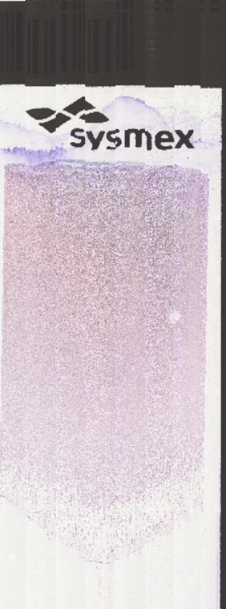
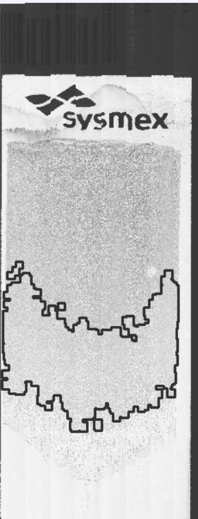
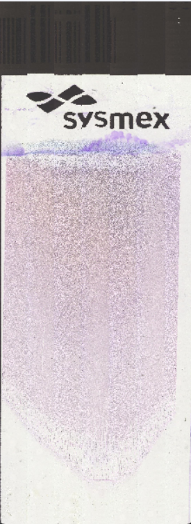
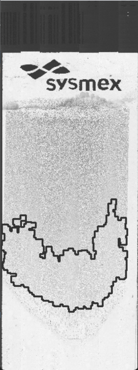
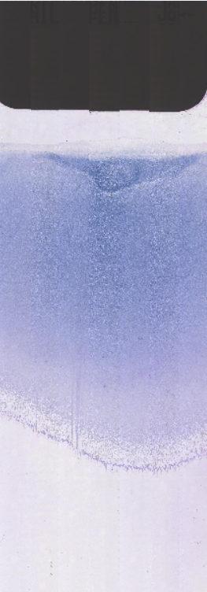
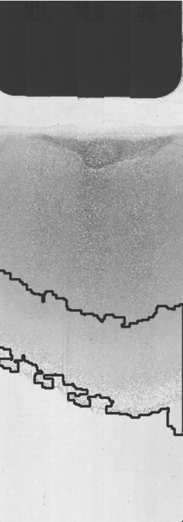
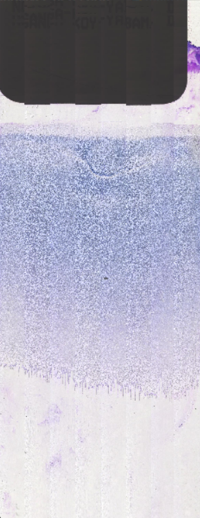
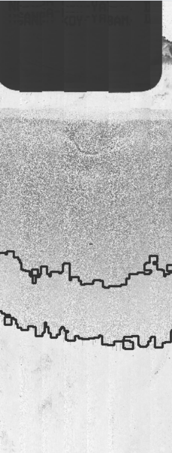

# monolayer_detection
Search monolayer in blood smears

# Short description
In medical clinical diagnostics, a sample of white blood cells is collected in the thin part of the smear.This program is aimed at creating an algorithm for detecting monolayer on blood smears.  

First, a map of the entire mask is made at a small magnification of 10x

Then the analysis of the drug maps is performed, followed by the detection of a thin part.     

In the detected thin part, a sample of leukocytes can be collected.

This technique is well suited when using automated microscopic platforms.

original image  monolayer area
  

original image  monolayer area 
  

original image  monolayer area 
  

original image  monolayer area
  

